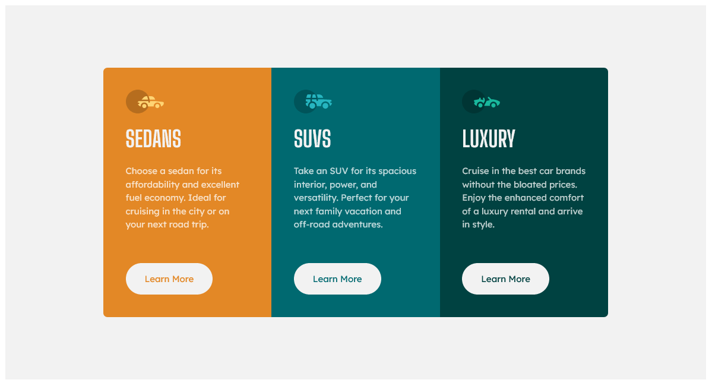

# Frontend Mentor - 3-column preview card component solution

This is a solution to the [3-column preview card component challenge on Frontend Mentor](https://www.frontendmentor.io/challenges/3column-preview-card-component-pH92eAR2-). Frontend Mentor challenges help you improve your coding skills by building realistic projects.

## Table of contents

- [Overview](#overview)
  - [The challenge](#the-challenge)
  - [Screenshot](#screenshot)
  - [Links](#links)
- [My process](#my-process)
  - [Built with](#built-with)
  - [What I learned](#what-i-learned)
  - [Continued development](#continued-development)
  - [Useful resources](#useful-resources)
- [Author](#author)
- [Acknowledgments](#acknowledgments)

## Overview

### The challenge

Users should be able to:

- View the optimal layout depending on their device's screen size
- See hover states for interactive elements

### Screenshot




### Links

- Solution URL: [Add solution URL here](https://your-solution-url.com)
- Live Site URL: [Add live site URL here](https://your-live-site-url.com)

## My process

### Built with

- Semantic HTML5 markup
- SCSS custom properties
- Flexbox
- Grid
- Desktop-first workflow

### What I learned

I am glad that I could figure out how to combine flex-box with grid.

```css
.card {
  display: flex;
  border-radius: 7px;
  overflow: hidden;
  max-width: 850px;
}

.card section {
  flex: 1;
  display: grid;
  grid-template-rows: 1fr auto;
  padding: 2.5em;
}
```

### Continued development

I find grid and flex-box is an amazing combination. I must improve these skills more.

## Author

- Frontend Mentor - [NT-squared](https://www.frontendmentor.io/profile/nt-squared)
